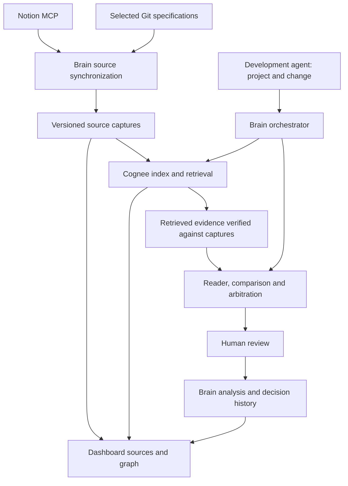

# Harmony Brain: Notion and Cognee integration plan

Architecture decision record for the private, single-instance pilot. Deployment and broader corpus evaluation remain separate release gates. Use the operating guides below for current setup and API behavior.

## Historical pilot verification — 16 September 2026

These observations describe that pilot run, not the current source approvals or connection state.

- Durable Notion OAuth connected to the selected workspace and survived a Brain restart. The original test page was captured and left as a draft during that run because it contained no dashboard requirements.
- Publication policy for this pilot is explicit approval in Brain, as chosen by the user. Notion properties remain preserved metadata; no inferred publication status is used.
- Cognee 1.5.4 indexed the dashboard README in approximately 31 seconds. A real reader/comparison/arbitration run on the safe-hook-summary feature completed in approximately 22 seconds and used verified source citations.
- Analysis `6c5ceb9b-c16c-42a1-b114-d62ec12e1008` recorded 7,691 input and 1,913 output tokens. This excludes Cognee indexing and embedding usage; it is not a dollar-cost report.
- Cognee retained the dataset after restart. Reusing its completed index took 69 ms without an add/cognify call; a scoped search returned an exact original passage in 2.613 seconds. Its graph contained 47 nodes and 98 edges.
- Automated fixtures cover twenty documents across two projects and a shared scope, withdrawal, source changes, failure recovery, immutable evidence, scoped retrieval, OAuth rotation, and signed webhook handling. This is not yet a retrieval-quality benchmark on twenty real company documents.
- Local-export ingestion, the ephemeral Notion command, fixed demonstration rules, and demo tabs have been retired. Existing source documents and stored analysis/review history remain untouched.

## Decisions carried forward

- Notion and the relevant Git repositories remain the authoritative sources.
- Brain owns project scope, captured source versions, analysis runs, citations, and human decisions.
- Evaluate Cognee as the single retrieval and knowledge-graph engine. Do not add Graphiti or require Obsidian.
- Keep one explicitly shared corpus and one corpus per project. A source being readable does not make it applicable or approved.
- Development agents call Brain. They do not need a direct connection to Notion or Cognee.
- Start with a small feature diff. Indexing an entire repository is not a prerequisite.
- Preserve original source content and its language. Treat document instructions as data, never as instructions to the ingestion service.
- Use portable containers and npm commands; no PowerShell-specific runtime dependency.

## Current operating guides

| Guide                                            | Maintained contract                                                               |
| ------------------------------------------------ | --------------------------------------------------------------------------------- |
| [Brain setup and HTTP analyses](BRAIN-AGENTS.md) | Startup, project scope, commit analysis and human review.                         |
| [Brain MCP](BRAIN-MCP.md)                        | Agent tools, project context and before-commit submissions over a known baseline. |
| [Notion connection and sources](NOTION-MCP.md)   | OAuth, recursive subpages, approval policies and synchronization.                 |
| [Cognee operations](COGNEE.md)                   | Indexing, retrieval, persistent storage and provider configuration.               |

The server preserves immutable captures and validates exact citation ranges. Current
source approvals and service availability are shown in Brain; they are not tracked
in this historical record.

## Implemented architecture

Cognee stores a derived index that can be rebuilt. The captured originals and review
history remain independently available. A generated relation never becomes an approved
requirement merely because it exists in the graph.

## Deployment recommendation

### Development and the first private pilot

The provided Compose service pins Cognee to a tested version/digest and keeps its system
and document storage in persistent volumes. Brain communicates with it over HTTP;
the existing application remains TypeScript.

The local pilot can use the embedded stores supported by that pinned Cognee release,
with one ingestion worker. Publish any development API port only on loopback. When both
services run in Compose, use the internal service address. There is no need for Cognee's
separate UI, MCP server, Redis, or a native Python installation on every developer machine.

The pinned image includes AMD64 and ARM64 manifests. Check engine availability and
resources on each deployment host. [Official minimal Compose guide](https://github.com/topoteretes/cognee/blob/main/docs/minimal-docker-compose.md)

### Moving to a Linux server

Reuse the same pinned application images and Compose base, with deployment-specific
secrets, hostnames, storage, and HTTPS configuration. The company has one central Brain
and Cognee instance for the pilot; each developer does not install a private production memory.

A small single-instance pilot can retain the tested embedded storage arrangement. Before
multiple ingestion workers or materially different user permissions, validate the storage
and isolation model. PostgreSQL plus pgvector and a supported graph backend is a candidate,
not an already approved migration. Test backup/restore and re-indexing; changing environment
variables is not a data migration. No Kubernetes requirement is introduced.

Do not assume the OSS PostgreSQL graph adapter is production-ready: Cognee labels that
adapter as a demo and documents a separate licensed production adapter. Dataset isolation
also depends on the chosen backend. [Graph stores](https://docs.cognee.ai/setup-configuration/graph-stores),
[permissions](https://docs.cognee.ai/setup-configuration/permissions)

Native installation remains possible, and a managed Cognee service is an alternative if
the company prefers outsourced operations. This plan selects self-hosted Docker to fit
the existing project and future Linux deployment.

## Evaluation and release gates

Before broader use, evaluate approximately twenty approved real documents across two
projects and a shared scope. Compare Cognee with a simple text-search baseline on the
same question set. Measure relevant-source retrieval, exact citation recovery,
project isolation, version correctness, response time, and provider usage. Include a document
that changes, one that is withdrawn, an unrelated project, and a question with no evidence.

Require zero cross-project or withdrawn-source leakage in these fixtures and exact traceability
for every cited passage. Determine acceptable latency and cost from the measured corpus.
Indexing needs generation and embedding models and may add provider charges; use explicit
models and avoid repeatedly rebuilding unchanged content. [Provider configuration](https://docs.cognee.ai/setup-configuration/llm-providers)

Before team deployment, validate access boundaries, concurrent requests, durable job recovery,
credential rotation, HTTPS, private service networking, and a backup restore. Keep SQLite and
single-worker limits explicit; select a more concurrent backend when the measured load requires it.

## Configuration and company prerequisites

Adjustable batch sizes, retry limits, freshness intervals, and retrieval limits belong in the
existing shared nonsecret Brain configuration. Environment-specific URLs, page mappings,
tokens, and encryption secrets remain server-side. Do not expose secrets through the UI's JSON import.

Remaining company and deployment inputs:

- A company-owned Notion identity or approved connection owner, plus access to selected sources.
- Approved project/shared source mappings; agree a Notion publication property only if replacing the current explicit Brain approval policy.
- A small second project corpus for the isolation test; the first remains the dashboard.
- A server hostname and HTTPS callback for deployment; webhook integration ownership separately.
- An approved generation/embedding provider configuration and a bounded evaluation budget.
- A decision on whether all team members may access the same corpus or need distinct document permissions.
- An owner for persistence, backups, dependency updates, and any optional commercial storage choice.

Remaining corpus evaluation should include a real approved Notion specification,
its index in containerized Cognee, a cited passage for a small feature change,
and preservation of that evidence across a restart and a later document edit.
